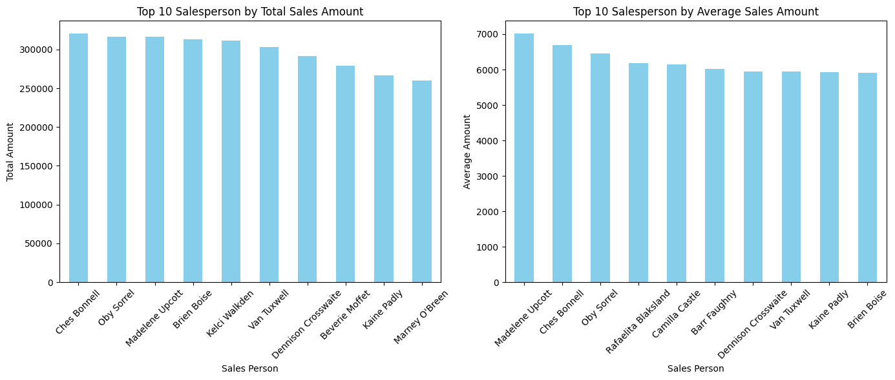
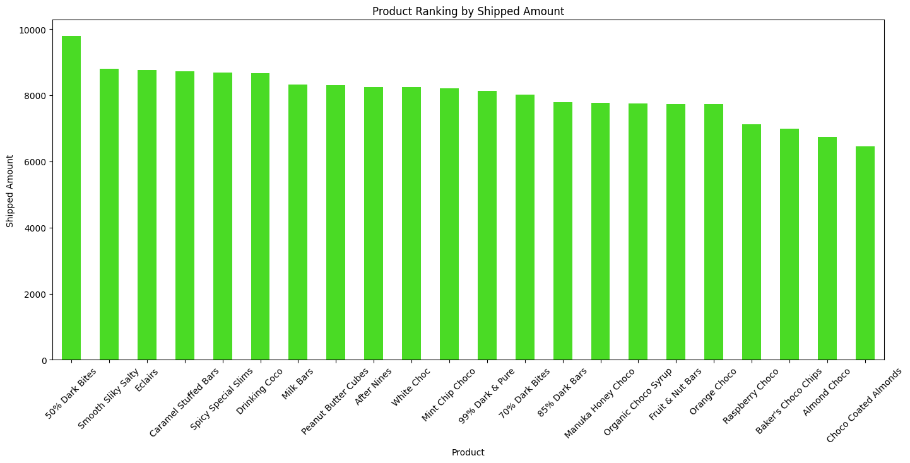

# Chocolate Sales Analysis

This project analyzes chocolate sales data to identify trends and provide actionable insights for improving sales strategies.

## Project Status: Completed

## Table of Contents

- [Project Overview](#project-overview)
- [Dataset Information](#dataset-information)
- [Project Structure](#project-structure)
- [Analysis Steps](#analysis-steps)
- [Key Findings](#key-findings)
- [Visualizations](#visualizations)
- [Usage](#usage)
- [Contributing](#contributing)
- [License](#license)

## Project Overview

The objective of this project is to perform an in-depth analysis of chocolate sales data to uncover patterns related to sales performance across different products, countries, and salespersons. The insights gained aim to inform business decisions and optimize sales strategies.

## Dataset Information

The dataset used in this analysis contains records of chocolate sales, including details such as:

- **Sales Person**: Name of the salesperson
- **Country**: Country where the sale occurred
- **Product**: Name of the chocolate product
- **Date**: Date of the sale
- **Amount**: Sales amount in dollars
- **Boxes Shipped**: Number of boxes shipped

*Note: The dataset is sourced from [provide source if available].*

## Project Structure

The repository is organized as follows:

- `data/`: Contains the dataset file (`Chocolate Sales.csv`)
- `notebooks/`: Jupyter notebooks with data analysis and visualizations
- `scripts/`: Python scripts for data processing and analysis
- `README.md`: Project documentation

## Analysis Steps

1. **Data Cleaning**: Corrected data types, and formatted the dataset for analysis.
2. **Exploratory Data Analysis (EDA)**: Examined the data distribution, identified patterns, and visualized relationships between variables.
3. **Sales Performance Analysis**:
   - Analyzed total and average sales per salesperson.
   - Evaluated product performance based on sales amount and boxes shipped.
   - Assessed sales distribution across different countries.
4. **Visualization**: Created charts and graphs to illustrate findings and support insights.

## Key Findings

- **Top Salespersons**: Identified the top-performing salespersons based on total and average sales amounts.
- **Product Performance**: Determined which chocolate products had the highest sales and shipment volumes.
- **Regional Insights**: Analyzed sales distribution across countries to identify key markets.

## Visualizations





## Usage

To replicate the analysis:

1. Clone the repository:
   ```bash
   git clone https://github.com/yourusername/chocolate-sales-analysis.git

2. Navigate to the project directory:
   ```bash
   cd chocolate-sales-analysis

3. Install the required packages:
   ```bash
   pip install -r requirements.txt

4. Access the Jupyter notebooks in the `notebooks/` directory to explore the analysis.

## Contributing

Contributions are welcome! Please fork the repository and submit a pull request with your changes.

## License

This project is licensed under the [MIT License](LICENSE).
